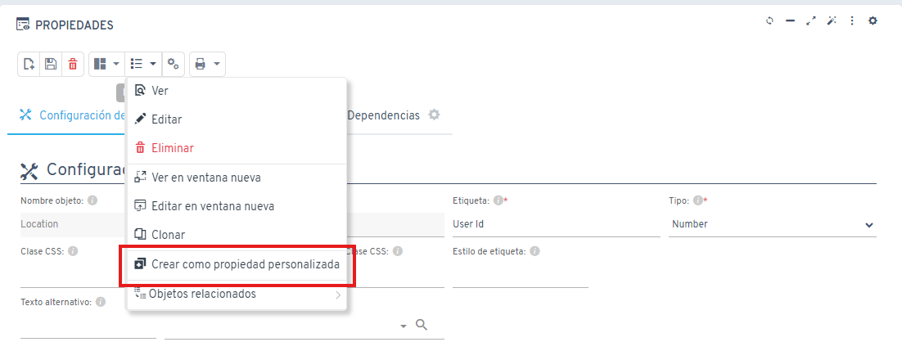

# ¿Sabías que puedes convertir una propiedad en una propiedad personalizada?

Las versiones recientes de Flexygo permiten crear una propiedad personalizada basada en una propiedad existente mediante un proceso específico.

Una vez completado este proceso, la propiedad personalizada resultante puede utilizarse en cualquier sección de la aplicación.
