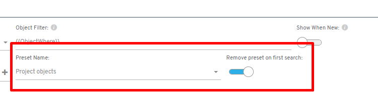

# Did you know you can set a default filter on a listing that clears itself after the first search?

This feature helps optimize performance on screens that are frequently used to filter information.

## Procedure

1. Set a default filter (such as "mine, today's, etc.")
2. Enable the **Remove on first search** option

As a result, once the initial filter has been applied, the custom criteria the user sets in later searches will take precedence.

This optimizes the speed of screens that are always used to filter data, since they come with preset parameters that automatically adjust to the user's needs.

