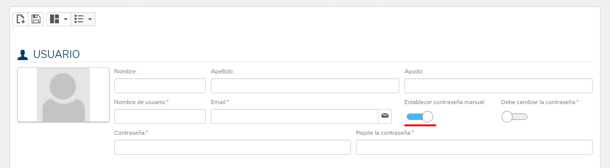

# Did you know we can create users with a preset password?

Starting with version 4.0.0.1, Flexygo lets you create users with passwords set administratively.

## Creation process

In the user creation form, select the **Set manual password** option. You can additionally enable **Must change password** to require the user to choose a new password after their first login.

## Main benefit

By setting a password manually from this form, the user will not need to confirm their password by email, since they will be validated automatically with the assigned password.

This feature speeds up user onboarding by avoiding the need for email confirmation, letting the user sign in immediately with the assigned credentials.
