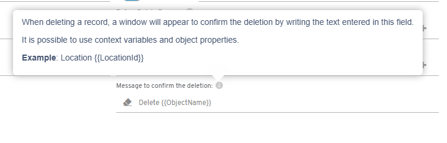
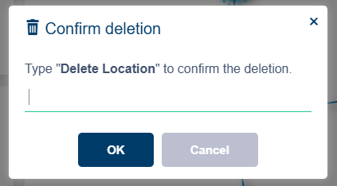

# ¿Sabías que puedes establecer un texto para confirmar el borrado de un registro?

Flexygo permite configurar en los objetos un mecanismo de seguridad mediante el cual se establece un texto de confirmación que el usuario debe escribir antes de eliminar un registro.

## Funcionalidades principales

* **Personalización**: el mensaje de confirmación puede adaptarse utilizando propiedades específicas del objeto
* **Seguridad mejorada**: añade una capa adicional de protección contra eliminaciones accidentales
* **Configuración flexible**: se gestiona directamente desde la configuración del objeto

## Propósito

Esta característica reduce significativamente los borrados no intencionales al requerir que los usuarios confirmen explícitamente sus acciones de eliminación de registros, proporcionando así mayor control sobre los datos críticos.

