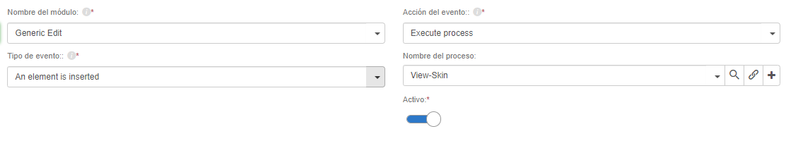
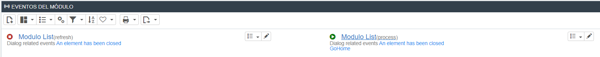

# Did you know we can disable module events?

Starting with Flexygo version 4.1.0.6, event management became more flexible. In the event creation/edit form you can choose whether it is active or not, letting you prevent that event from running without having to delete it.

## Features

* **Disable events without deleting them**: users can disable events on modules without needing to remove them from the system
* **Visibility in the listing**: the event list makes it easy to see at a glance which events are active and which are not

## Benefits

This feature provides greater flexibility in event administration, letting you temporarily pause execution without losing the existing configuration.
