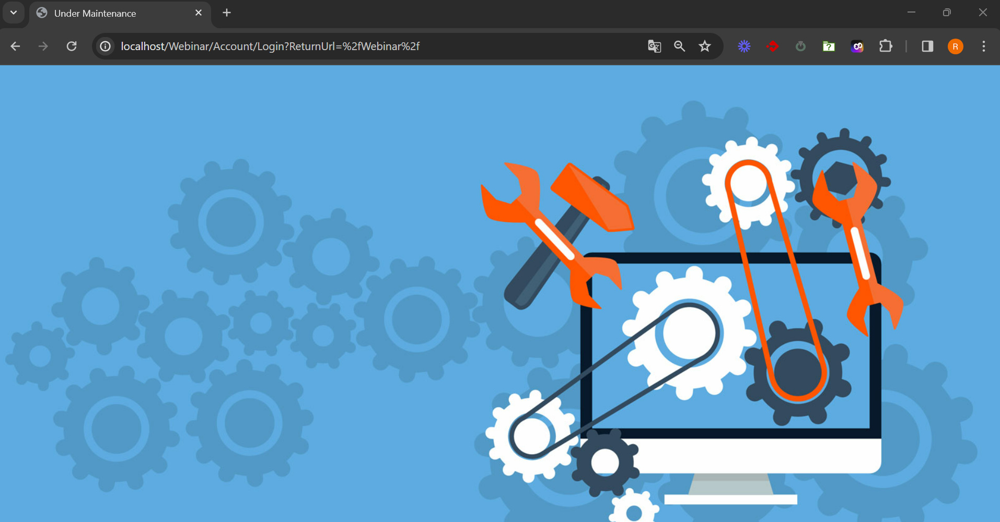

# ¿Sabías que Flexygo tiene un modo de parada de emergencia?

Flexygo ofrece dos modos para gestionar la disponibilidad de la aplicación.

## Modo de mantenimiento

Los administradores pueden mantener la aplicación operativa mientras se realizan tareas de actualización.

## Modo de parada de emergencia

Para detener completamente una aplicación, se puede renombrar el archivo `app_online.htm` a `app_offline.htm` en la ruta raíz de la aplicación. Esto generará:

* **Bloqueo de conexiones**: se pararán todas las conexiones del sistema
* **Mensaje en navegador**: se mostrará una página indicando el estado offline

## Restauración del servicio

Una vez finalizado el mantenimiento, se restaura el nombre original del archivo y el servicio se restablece automáticamente.

!!! warning "Advertencia importante"
    Esta acción dejará la aplicación completamente inaccesible.
