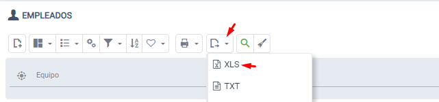
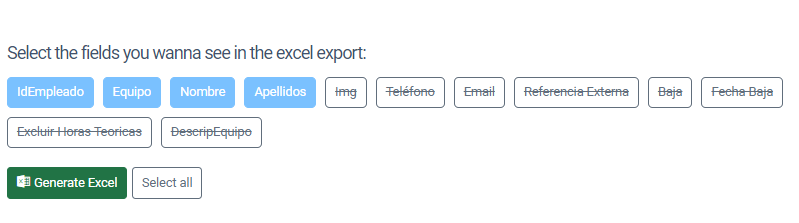

# ¿Sabías que puedes elegir las columnas que quieres exportar a Excel?

Tan solo haz clic en la opción de exportar a Excel de cualquier lista y automáticamente te preguntará qué campos quieres usar en el informe.

## Procedimiento

1. Selecciona la opción de exportar a Excel desde cualquier listado
2. El sistema solicitará automáticamente qué campos deseas incluir en el informe
3. Elige los campos deseados para personalizar el documento exportado
