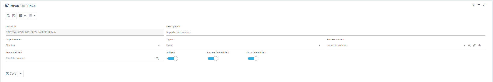
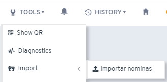
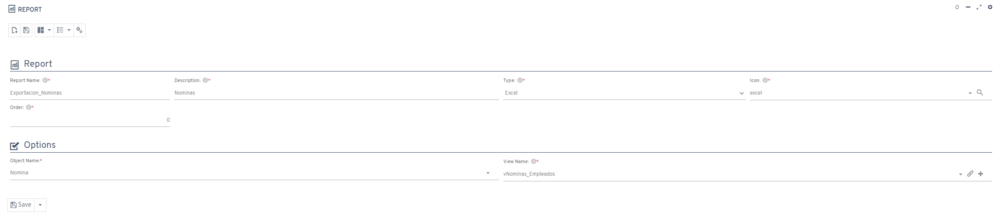

# ¿Sabías que puedes importar/exportar Excel de manera sencilla?

## Importar Excel

Para importar archivos Excel, realiza una configuración básica desde el menú de importaciones. Necesitas seleccionar:

* El objeto a importar
* El proceso generado para la importación
* La plantilla a utilizar

Una vez configurado, el proceso estará disponible en el menú de herramientas para importar Excel de forma directa.

## Exportar Excel

Aunque existe una opción estándar de exportación en los listados, esta no es idónea para grandes volúmenes de datos. Por esta razón, puedes crear un informe de tipo Excel.

El proceso es simple: indica el objeto y la vista deseados, y la exportación quedará configurada. Posteriormente, estará disponible en el menú de procesos del objeto como cualquier otro informe.
