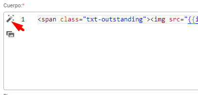
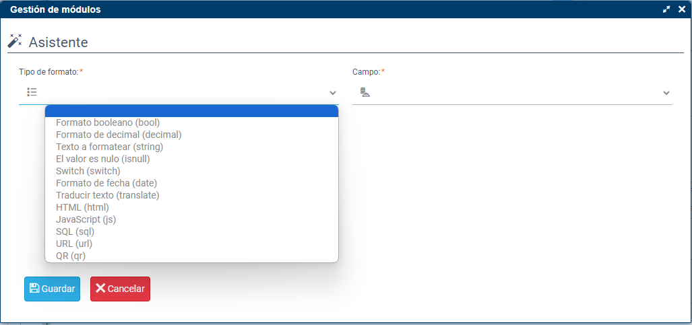
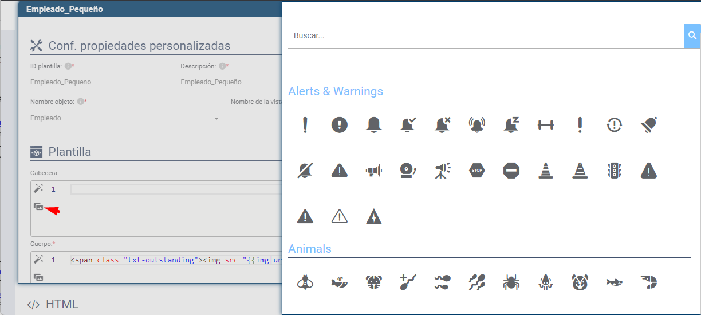

# ¿Sabías que puedes dar formato a un campo sin necesidad de memorizar todos los tipos?

Flexygo incluye una herramienta asistente que facilita la incorporación de campos a plantillas, permitiendo aplicar el formato deseado de manera intuitiva.

## Proceso paso a paso

1. Haz clic en el botón disponible junto al código de la plantilla
2. Sigue las instrucciones que proporciona el asistente

La plataforma también ofrece un acceso a los iconos de la aplicación justo debajo del asistente, proporcionando herramientas visuales complementarias para personalizar campos sin requerir conocimientos técnicos profundos sobre tipologías de datos.

