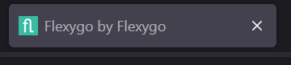
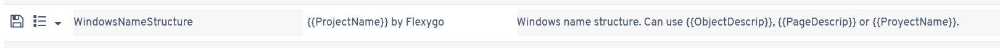

# ¿Sabías que puedes establecer un patrón para el título de la ventana de Flexygo?

Dentro de los parámetros de Flexygo existe una opción llamada **WindowsNameStructure** que permite personalizar cómo aparece el nombre de la ventana. Esta funcionalidad es particularmente útil porque posibilita que el título se actualice dinámicamente mientras navegas por la aplicación.

## Características principales

* **Personalización del título**: puedes definir el patrón exacto que deseas para el nombre de la ventana
* **Marcadores dinámicos**: la solución admite marcadores que representan atributos del objeto o información de la página actual que se está visualizando
* **Navegación intuitiva**: el título se modifica automáticamente conforme cambias entre diferentes secciones, proporcionando contexto sobre tu ubicación en la aplicación

## Implementación

La configuración se realiza mediante el parámetro `WindowsNameStructure` en los ajustes de Flexygo, permitiendo crear patrones personalizados que reflejen la estructura y contenido específico de cada vista.

