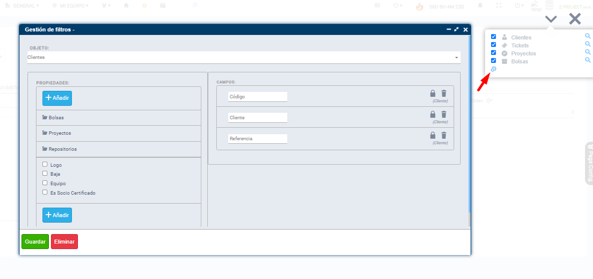

# Did you know Flexygo has a generic search for every object?

Flexygo lets you configure a generic search for any object in the application, a feature that is often overlooked during development.

## How to use it

1. Enable developer mode
2. Click the magnifying-glass icon located in the top bar
3. Set every search field you want for any object in the application

