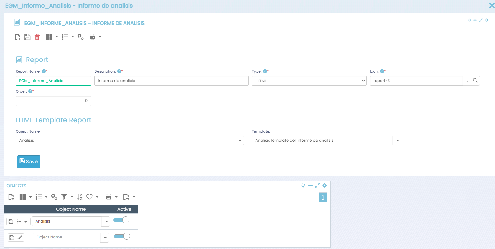
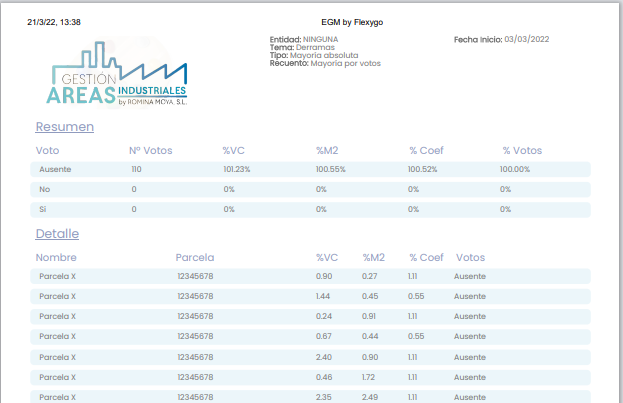

# ¿Sabías que podemos generar informes en HTML?

Es posible crear informes en Flexygo utilizando una plantilla HTML asociada a un objeto específico. El proceso implica dos pasos principales:

1. **Crear una plantilla HTML** para el objeto deseado
2. **Generar un informe nuevo** seleccionando el tipo HTML, el objeto correspondiente y la plantilla creada

## Ventajas

Esta funcionalidad permite generar informes de forma rápida y sencilla sin necesidad de recurrir a herramientas como Crystal Reports.

