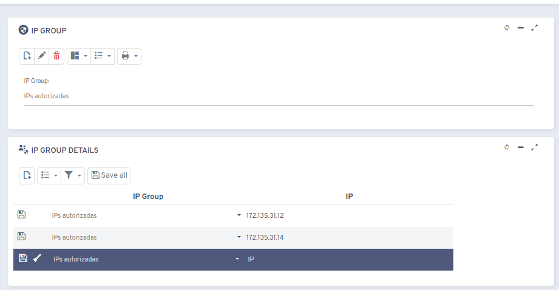

# Did you know you can restrict access to Flexygo by IP?

This feature lets you implement IP-address-based access restrictions within the Flexygo platform.

## Main features

* **Authorized IP groups**: you can define sets of allowed IP addresses
* **Assignment to users**: the created groups can be linked to specific user accounts
* **Use cases**: useful for restricting access to specific locations only, such as the corporate office

## How to configure it

1. Go to **Security > IP Groups** to create the IP address groups
2. Assign the created groups while managing or editing users in the system

This feature provides an extra layer of security by controlling where authenticated users can access the platform from.
