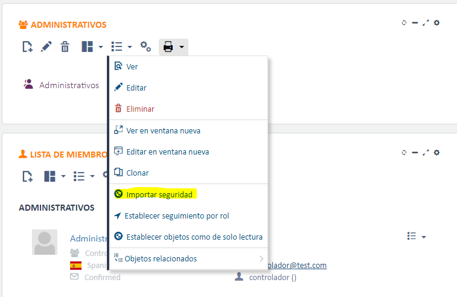

# Did you know we can import role and user security?

You can import a security configuration already defined at the role level into another role, without needing to set it up from scratch. The process is simple: go to the new role, run the import security process and select the role you want to get the configuration from.

This same option is also available at the user level.
