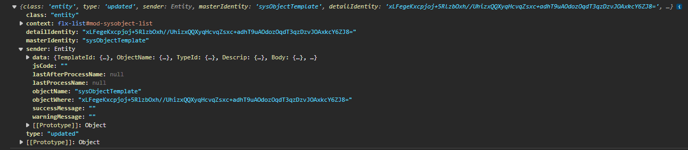

# ¿Sabías que puedes manejar eventos de Flexygo por JavaScript?

Puedes utilizar las funciones `flexygo.events.on` y `flexygo.events.off` para gestionar eventos en Flexygo mediante JavaScript.

## Ejemplo práctico

Un caso de uso habitual es refrescar un módulo únicamente cuando el cliente tiene estado activo:

1. Se define una función de callback que verifica condiciones específicas:
    * Comprueba si el remitente es una instancia de `flexygo.obj.Entity`
    * Valida que el nombre del objeto sea "Cliente"
    * Confirma que el campo Activo tenga valor 1
2. Se obtiene el elemento HTML del módulo usando un selector de consulta
3. Se suscribe el módulo al evento utilizando `flexygo.events.on()` con los parámetros: el módulo, el tipo de evento ("entity"), la acción ("updated") y la función callback

## Datos disponibles

Cuando se ejecuta el evento, el parámetro de callback proporciona datos cuyo remitente corresponde a la clase del evento (por ejemplo, `flexygo.Process` para eventos de proceso).

