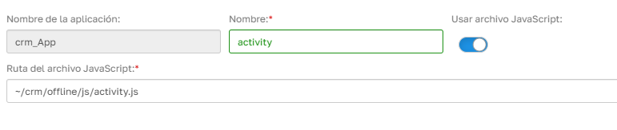

# ¿Sabías que puedes añadir JavaScript a la aplicación offline directamente desde un archivo?

Es posible incluir código JavaScript en una aplicación offline cargándolo desde un archivo físico.

## Ventajas

Este enfoque facilita el mantenimiento del código y permite reutilizar lógica entre diferentes partes de la aplicación.

