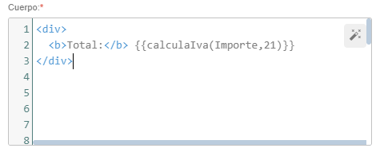

# ¿Sabías que puedes llamar funciones JavaScript desde las propias plantillas de Flexygo?

Flexygo permite invocar funciones JavaScript directamente desde las plantillas utilizando una sintaxis específica. Para implementar esta funcionalidad, debes estructurar tu marcador siguiendo este patrón: `{{miFuncionJS(param1, param2, ...)}}` y Flexygo llamará a la función.

El sistema procesará automáticamente la llamada y mostrará el resultado en la plantilla. Una característica útil es que si los nombres de los parámetros coinciden con campos existentes en la plantilla, el sistema convertirá automáticamente estos parámetros a sus valores correspondientes.

