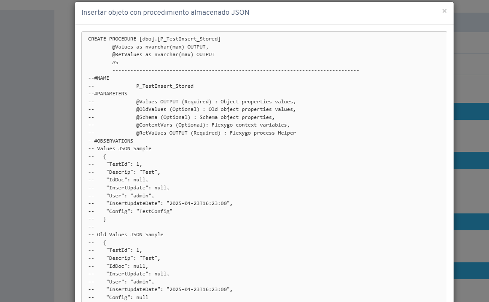

# Did you know you can manage object insert, update and delete actions with JSON procedures?

In recent versions of Flexygo, you can manage object insert, update and delete actions through stored procedures using JSON.

This feature **complements the pre-existing option that uses XML** to perform these data manipulation operations.

## Documentation location

For detailed information and practical examples about this feature, check Flexygo's built-in help under: **Help → Programming → Update types**.

