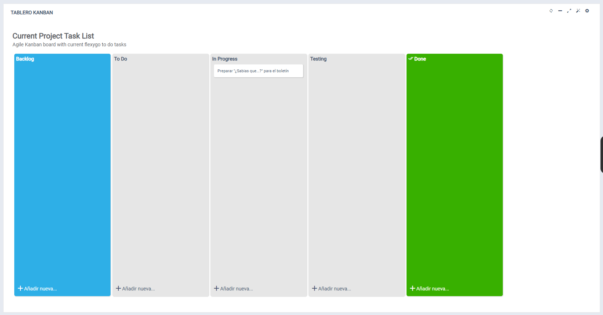
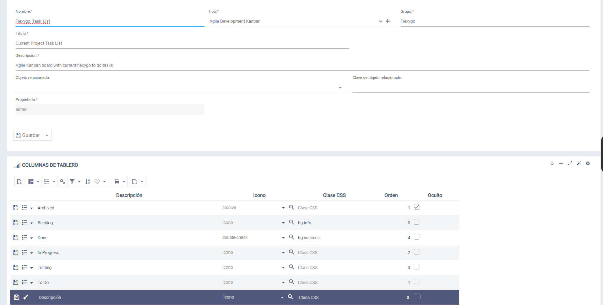

# Did you know every Flexygo instance has a kanban for managing custom boards?

There is an object called **Boards** that makes it easy to create multiple custom boards with adjustable columns. Every instance ships with a first board containing the basic development cycle states.

## Main features

The Boards tool lets users:

* Create as many boards as needed
* Customize the columns according to their specific requirements
* Access a default board that includes standard development-cycle states
