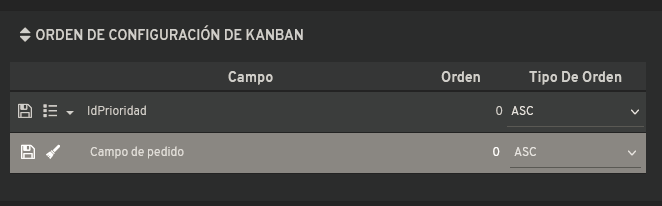

# ¿Sabías que puedes establecer un orden fijo para las tarjetas de un Kanban?

Desde la configuración del kanban es posible definir los campos según los cuales se ordenarán automáticamente las tarjetas, en lugar de utilizar el orden libre que viene predeterminado.

Por ejemplo, las tarjetas pueden aparecer siempre organizadas por prioridad una vez que se configura este parámetro en el sistema.

La funcionalidad permite personalizar el comportamiento del kanban para mantener una estructura ordenada según criterios específicos del proyecto o flujo de trabajo que se esté utilizando.
