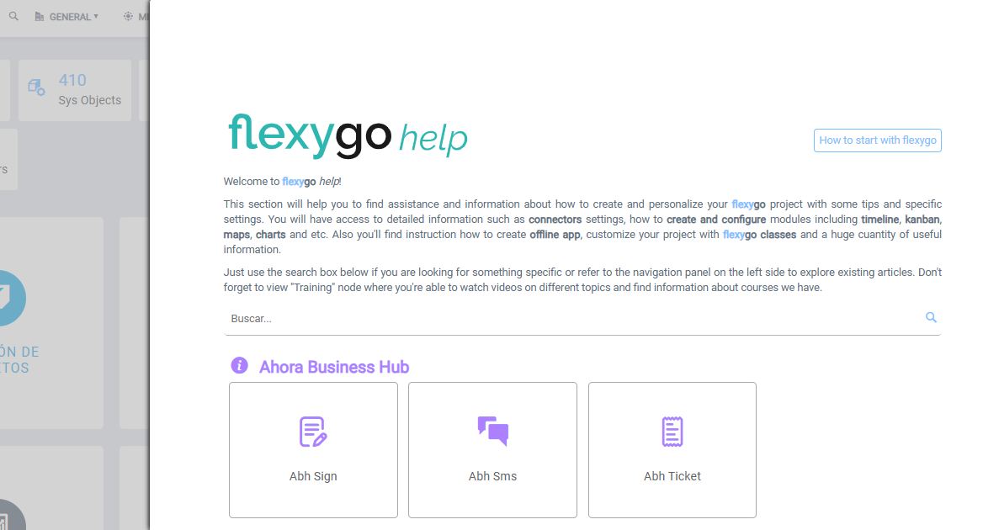

# ¿Sabías que Flexygo dispone de atajos de teclado?

Flexygo cuenta con tres atajos de teclado útiles:

* **F1**: abre la ayuda de la herramienta
* **F2**: accede a los parámetros de configuración
* **Ctrl + S**: guarda cambios cuando el foco está en un formulario de edición

## Capturas

