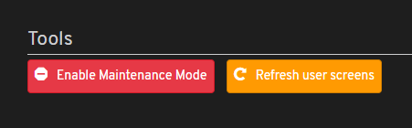
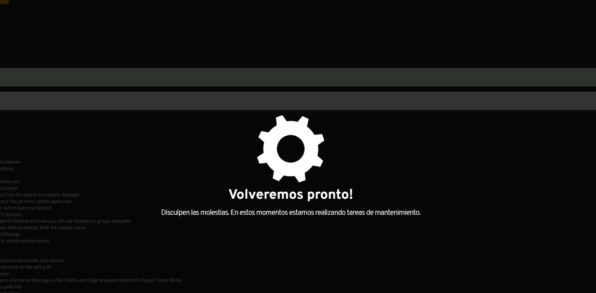
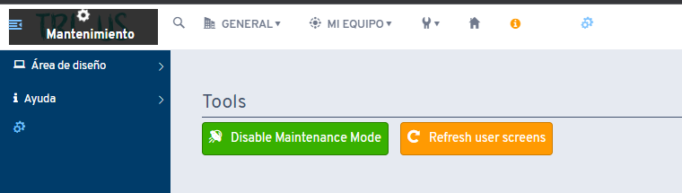
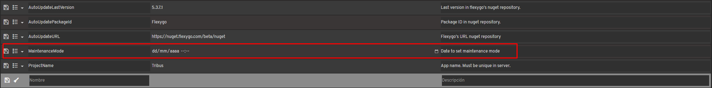
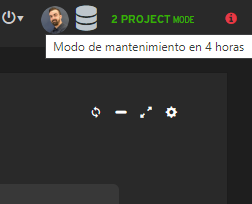

# ¿Sabías que existe un modo para realizar labores de mantenimiento en la aplicación?

A partir de la versión 5.3 de Flexygo, se incorpora un modo de mantenimiento accesible mediante el panel de actualización.

## Características principales

Dos opciones disponibles:

1. Activación del modo mantenimiento para todos los usuarios, exceptuando el usuario admin
2. Capacidad de refrescar pantallas de todos los usuarios o de uno específico

## Comportamiento en modo mantenimiento

* Los usuarios regulares ven una interfaz de mantenimiento

* El usuario administrador mantiene acceso completo a la aplicación

## Desactivación del modo

Para desactivar el modo mantenimiento, puedes usar el propio botón del panel de actualización o hacer clic en la ventana de mantenimiento que aparece arriba a la izquierda sobre el logo.

## Mantenimiento programado

Se añadió un nuevo setting en el bloque Version Update que permite establecer un mantenimiento futuro. Cuando se programa una fecha, aparece un aviso a todos los usuarios indicando el tiempo restante.

