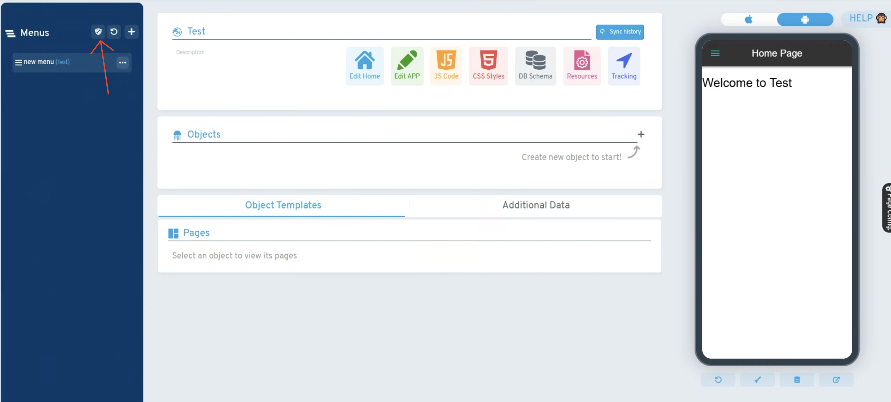

# ¿Sabías que puedes añadir seguridad a los menús del App?

Desde el escudo disponible en la sección de Menús del panel App Offline, es posible implementar controles de acceso basados en roles, usuarios y permisos específicos. Esta funcionalidad permite personalizar la visibilidad de los distintos menús según la identidad del usuario que inicie sesión en la aplicación.

La característica facilita ocultar o mostrar opciones de menú de manera selectiva, mejorando así la seguridad y experiencia de usuario al limitar el acceso solo a las funciones pertinentes para cada perfil.

