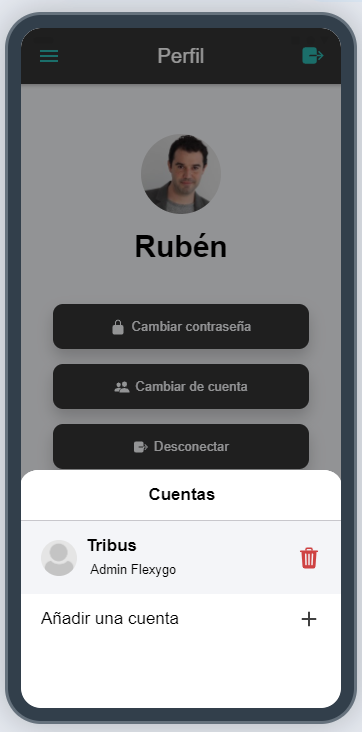

# ¿Sabías que puedes tener más de una cuenta en Flexygo Mobile?

Flexygo Mobile permite gestionar múltiples cuentas simultáneamente, con la capacidad de cambiar entre ellas sin necesidad de tener conexión.

## Tipos de cuentas soportadas

El sistema admite cuentas que pueden variar en:

* Distintos dominios
* Distintos usuarios
* Distintas aplicaciones del mismo dominio

