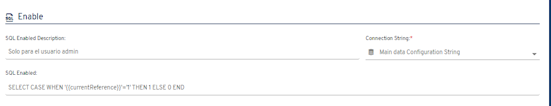

# ¿Sabías que puedes habilitar y deshabilitar nodos a través de una consulta SQL?

A partir de la versión 4.5.0.1, Flexygo permite habilitar y deshabilitar nodos mediante consultas SQL.

## Funcionamiento

La configuración del nodo incluye una nueva sección denominada **Enable** que utiliza una consulta SQL para determinar si un nodo debe estar habilitado o deshabilitado.

