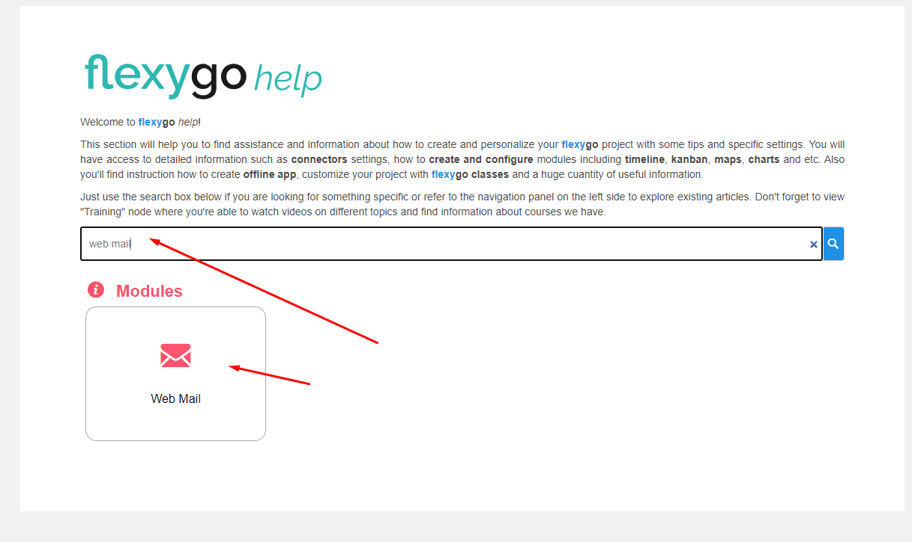
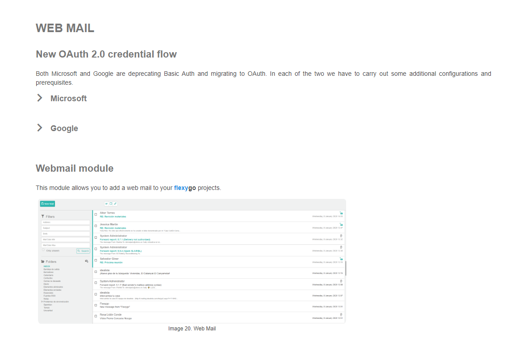
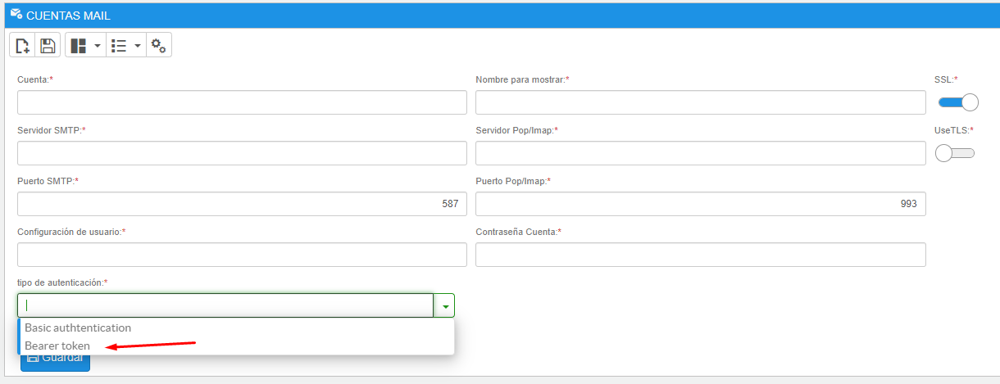

# ¿Sabías que ahora puedes configurar las cuentas de correo y Web Mail de las aplicaciones con el protocolo OAuth 2.0?

Las cuentas de correo utilizadas en la sección Web Mail ahora pueden configurarse usando el protocolo OAuth 2.0. Esta capacidad se extiende tanto a cuentas de Microsoft como de Google.

## Características principales

* **Ayuda integrada**: la plataforma incluye asistencia incorporada para la configuración
* **Nueva opción de autenticación**: la configuración de cuentas muestra ahora una nueva sección de tipo de autenticación
* **Soporte de Bearer Token**: los usuarios pueden configurar el nuevo método de autenticación mediante la opción de bearer token

