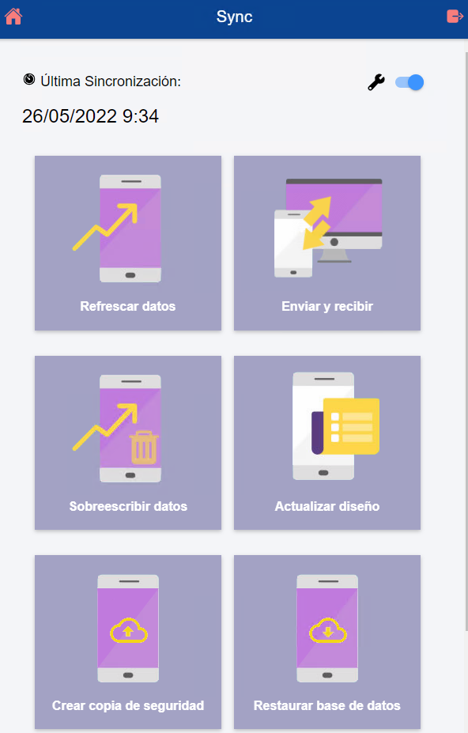

# Did you know you can create and restore backups of the offline application?

You can back up the database in Flexygo's offline application.

## Procedure

To access these functions, go to the application's synchronization menu. Once there, turn on the **advanced options** switch and you will find two main buttons at the bottom of the screen:

1. **Create backup**: generates a file with the data currently stored in the application
2. **Restore backup**: lets you load a previously created backup file to recover the saved data

This process lets you preserve the application's information and transfer it between devices or restore it when needed.

