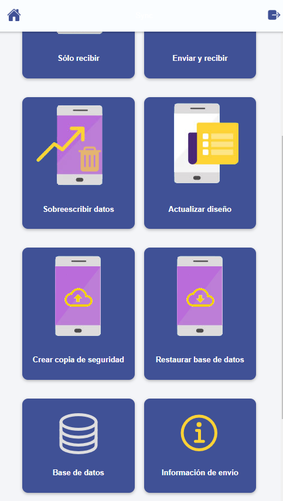
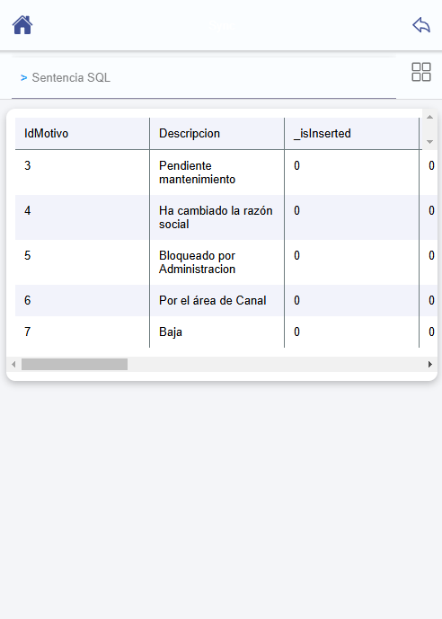

# ¿Sabías que puedes consultar la base de datos de la aplicación offline?

La aplicación Flexygo permite acceder a la base de datos en modo offline mediante una funcionalidad disponible en el menú de sincronización.

## Acceso a la función

Para utilizar esta característica, dirígete al menú de sincronización de la app y activa el interruptor de **opciones avanzadas**. Al final de esa pantalla encontrarás el botón **Base de datos**.

## Funcionalidades disponibles

Una vez accedas a esta sección, tienes dos opciones:

1. **Escribir consultas personalizadas** usando SQLite
2. **Seleccionar directamente** la tabla que deseas consultar

Esta funcionalidad permite consultar de manera flexible la base de datos local sincronizada en tu dispositivo, facilitando el acceso a información sin conexión a internet.
