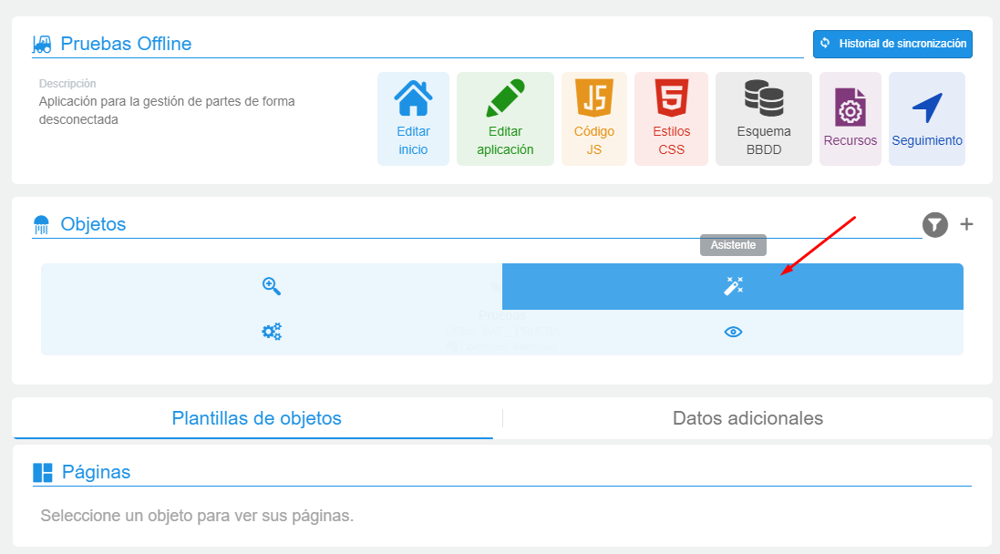
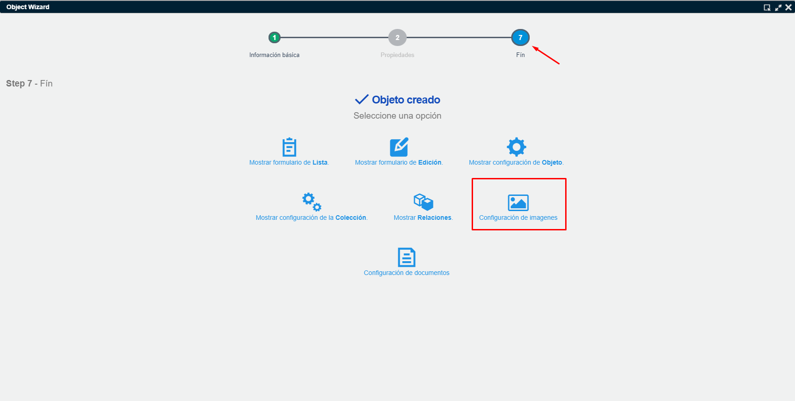
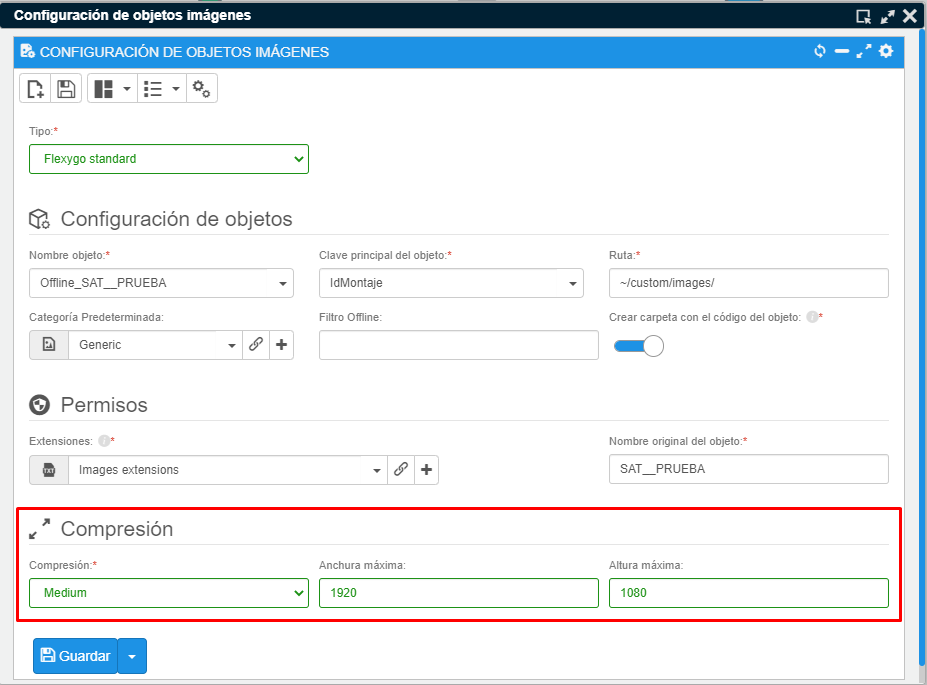

# ¿Sabías que puedes redimensionar las imágenes provenientes del offline?

A partir de la versión 4.6.0.1 de Flexygo, la sección offline permite configurar la compresión de imágenes para evitar que estas se almacenen en la base de datos con tamaños excesivos.

## Pasos para configurar la compresión

1. Accede al asistente del objeto que posea la configuración de imágenes

2. Navega al paso 7 e ingresa en la configuración de imágenes

3. Asigna valores en el apartado de compresión mediante tres parámetros:
    * **Compresión**: ofrece cuatro niveles: "Nothing", "Low", "Medium" y "High". Los últimos tres reducen el tamaño pero afectan la calidad visual
    * **Anchura máxima** y **Altura máxima**: establecen dimensiones límite para las imágenes, manteniendo las proporciones originales sin superar los valores especificados

Esta funcionalidad optimiza el almacenamiento de datos al permitir que la aplicación redimensione automáticamente las imágenes capturadas en modo offline.
