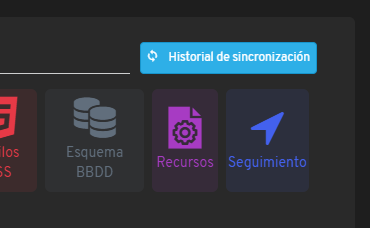

# ¿Sabías que puedes acceder al listado del historial de sincronizaciones de la app offline?

En Flexygo existe la posibilidad de consultar el registro completo de las sincronizaciones realizadas por la aplicación offline y ejecutarlas nuevamente si se detectaron problemas durante el proceso inicial.

Esta característica proporciona valor significativo a los usuarios que trabajan con la versión offline de Flexygo. Les permite verificar que todas las sincronizaciones completaron correctamente y, en caso contrario, reejecutarlas sin necesidad de reiniciar todo el proceso de sincronización.

Además, acceder al historial de sincronizaciones otorga a los usuarios mayor supervisión sobre las actualizaciones aplicadas en la aplicación, permitiéndoles confirmar que los datos permanecen actualizados de manera continua.

