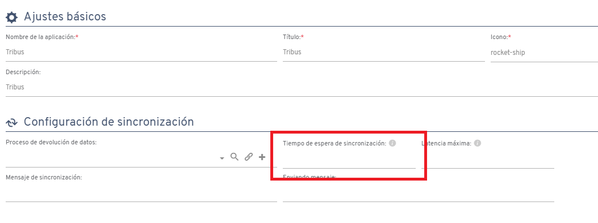

# Did you know that in Flexygo you can set the synchronization timeout in the offline app?

Flexygo lets you configure the timeout for synchronization in the offline application, improving the user experience and optimizing data transfer.

This feature lets you customize the synchronization intervals between the offline app and the connected database. This makes it possible to adapt the parameters to each organization's particularities, ensuring data is updated quickly and efficiently.

The timeout adjustment is also especially useful in scenarios where the internet connection is poor or unstable. Users can configure these timeouts to ensure the application works without interruptions, allowing for a smoother experience and reliable synchronization in any circumstance and location.

