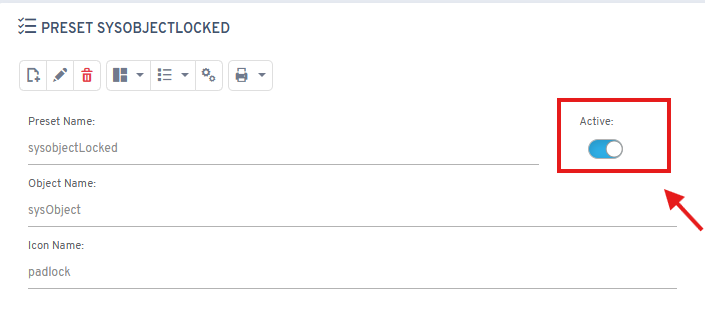

# ¿Sabías que puedes activar/desactivar presets vinculados a objetos?

En las últimas versiones de Flexygo, es posible activar/desactivar presets vinculados a objetos, lo que facilita gestionar los presets almacenados.

Esta funcionalidad permite a los usuarios administrar de manera más eficiente los ajustes predefinidos que se encuentran asociados a distintos objetos dentro de la plataforma Flexygo.

