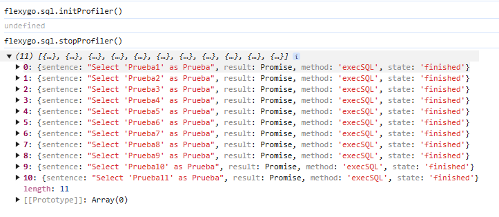
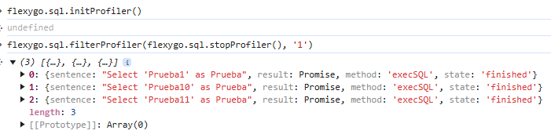

# ¿Sabías que puedes activar el profiler en la App Offline desde cualquier lugar?

La aplicación offline de Flexygo incluye una herramienta de profiling que puedes utilizar desde cualquier ubicación de la aplicación.

## Funciones principales

Para acceder al profiler, necesitas conocer dos funciones fundamentales:

* **flexygo.sql.initProfiler**: inicia el registro de todas las consultas SQL y sus resultados
* **flexygo.sql.stopProfiler**: detiene el registro y muestra los datos capturados en la consola

## Filtrado de resultados

Cuando trabajas con ediciones complejas que contienen múltiples dependencias, puedes utilizar:

* **flexygo.sql.filterProfiler**: permite buscar sentencias específicas en los datos registrados

Esta función no distingue mayúsculas de minúsculas por defecto, pero puedes modificar este comportamiento pasando `true` como tercer parámetro si necesitas una búsqueda sensible a mayúsculas.

