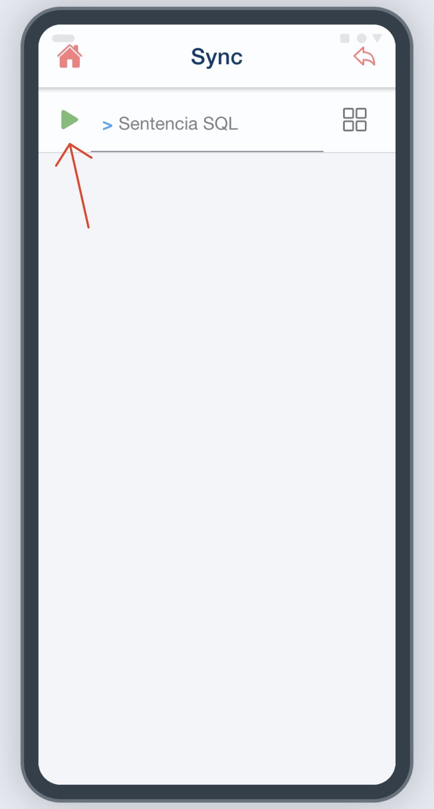
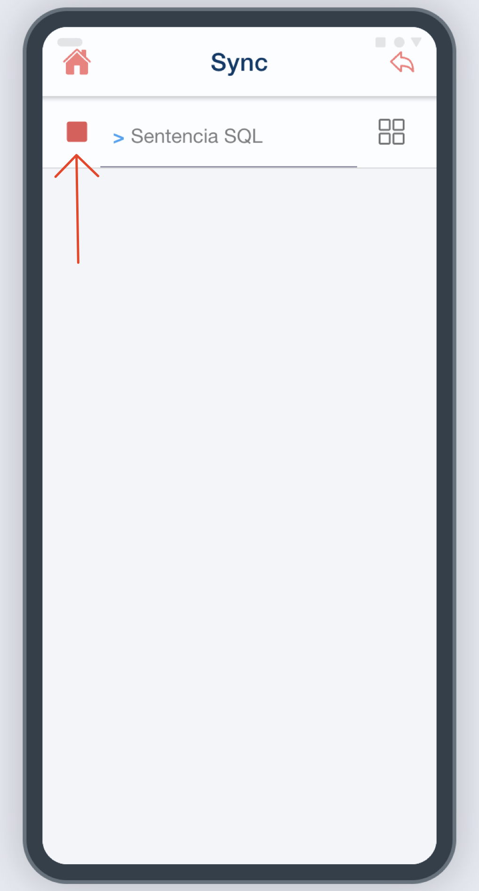
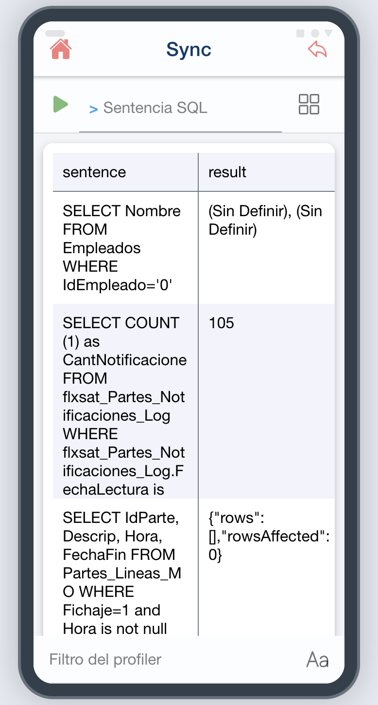

# ¿Sabías que puedes utilizar un profiler para las consultas de la App Offline?

Para acceder al profiler de la aplicación, dirígete al menú de base de datos. Allí encontrarás un botón verde que, al pulsarlo, comenzará a registrar todas las sentencias SQL ejecutadas y sus resultados.

## Pasos para usar el profiler

1. **Activar el registro**: haz clic en el botón verde en el menú de base de datos
2. **Navegar**: desplázate hacia la pantalla que deseas analizar para que se registren las sentencias y resultados
3. **Detener el registro**: regresa al menú de base de datos y haz clic en el cuadro rojo
4. **Visualizar resultados**: se mostrarán todas las consultas SQL ejecutadas con sus resultados

## Funcionalidad adicional

El profiler incluye un filtro en la parte inferior que permite mostrar únicamente aquellas sentencias que contienen texto específico, facilitando la búsqueda y análisis de consultas particulares.

