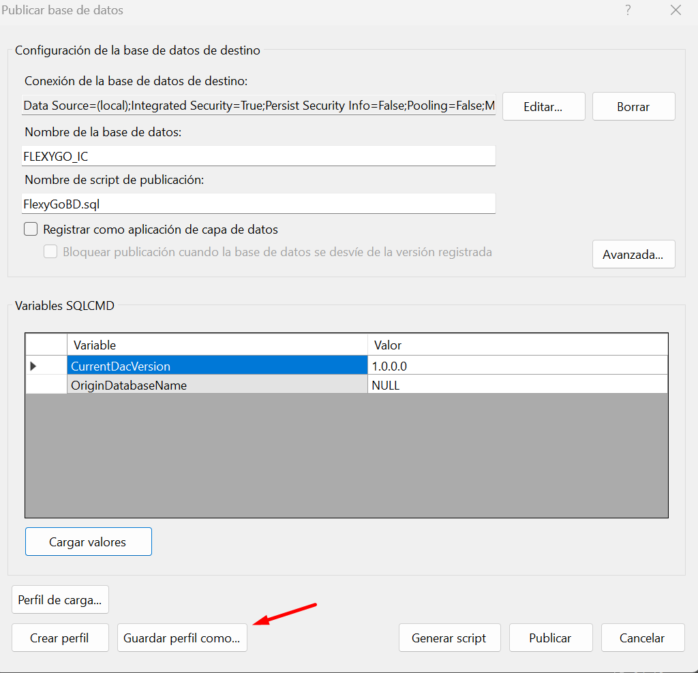
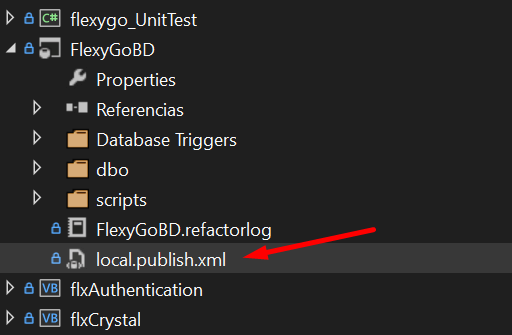

# ¿Sabías que puedes publicar la base de datos con solo doble clic?

La publicación de bases de datos en Flexygo puede realizarse de manera simplificada mediante un proceso de dos pasos.

## Paso 1: configurar la publicación

Accede al menú contextual (botón derecho) y selecciona "Publicar". Completa todos los pasos del asistente de publicación configurando los parámetros necesarios.

## Paso 2: guardar el perfil

Antes de hacer clic en el botón final de publicación, selecciona **Guardar perfil como...** para almacenar la configuración.

## Uso posterior

Una vez guardado el perfil, la publicación se simplifica considerablemente. Tan solo necesitas hacer doble clic en el fichero de publicación para ejecutar el proceso sin necesidad de reconfigurar los parámetros cada vez.

