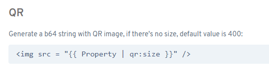

# Did you know you can generate QR codes with Flexygo?

To create QR codes in Flexygo, you just need to add a specific marker in your configuration. The method is very direct: add the marker with the field's name followed by a pipe and the word QR.

This feature lets you generate QR codes easily, directly from the platform, without needing any additional external tools.
