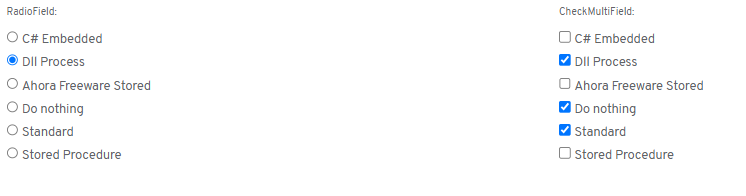

# ¿Sabías que Flexygo dispone de controles de tipo Radio y Multiple checkbox?

Flexygo ofrece controles de interfaz de usuario llamados Radio y Multiple checkbox que funcionan de manera similar a los controles combo y multicombo.

La principal característica que diferencia estos controles es su presentación visual: su aspecto muestra todos los valores por pantalla y puede ser una buena opción para que el usuario seleccione la opción con más agilidad en casos donde disponemos de pocos valores en los que decidir.

Estos controles resultan especialmente útiles cuando:

* Hay un número limitado de opciones disponibles
* Se requiere una selección más rápida por parte del usuario
* Se prefiere una interfaz más directa y visual
