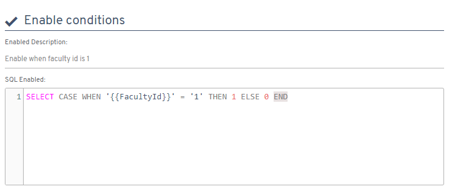

# ¿Sabías que puedes habilitar y deshabilitar la relación de un objeto a través de una consulta SQL?

A partir de la versión 4.9.0.1, Flexygo incorpora la capacidad de controlar dinámicamente las relaciones entre objetos. La plataforma introduce una nueva sección denominada **Enable conditions** en la configuración de relaciones.

## Funcionalidad principal

Esta característica permite a los usuarios emplear consultas SQL para determinar si una relación entre objetos debe estar activa o desactivada.

## Aplicación práctica

La solución se implementa directamente en los parámetros de configuración de relaciones entre objetos dentro del sistema Flexygo, proporcionando mayor flexibilidad en la gestión de datos y flujos de trabajo.

