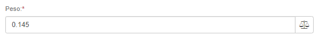

# Did you know you can integrate Flexygo with scales?

Flexygo supports integration with weighing devices. Users can capture weight data in two ways:

1. **Manual method**: pressing a button located in the text field to capture the weight
2. **Automated method**: configuring triggers that collect the data automatically

For additional technical details, check the documentation at **Help → Connectors → Scales**.

## Screenshots

