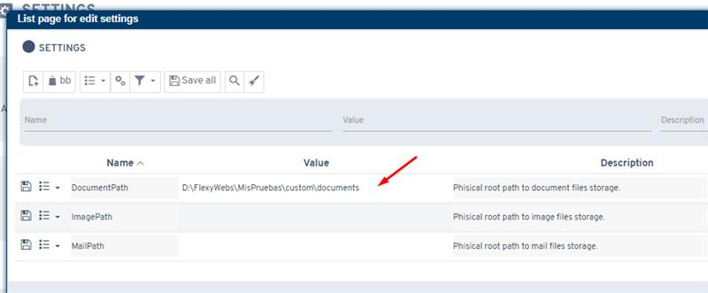
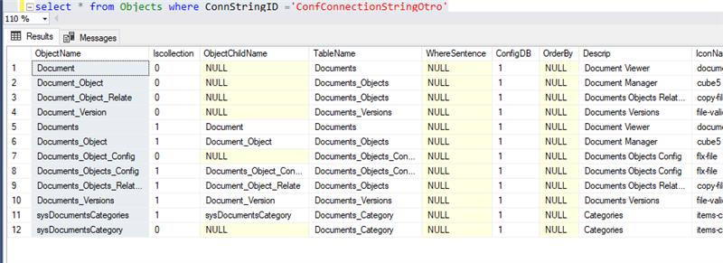

# ¿Sabías que dos aplicaciones Flexygo pueden compartir una sola gestión documental?

Es muy habitual el caso de que un Flexygo empresarial y un portal de cliente compartan la gestión documental. Cuando ambas aplicaciones están vinculadas al mismo ERP, no hay problemas. Sin embargo, cuando ambas son instancias Flexygo, se puede usar una como repositorio principal mientras la segunda accede directamente a los documentos compartidos.

## Pasos de configuración

**Paso 1 - Estructura de aplicaciones**

* Una aplicación principal con base de datos y configuración propias
* Una segunda aplicación con su propia base de datos y configuración, más una tercera conexión apuntando a la base de datos de configuración de la aplicación principal

**Paso 2 - Ruta común**

Configurar un setting que especifique la ruta común donde se guardarán los documentos compartidos.

**Pasos 3-5 - Actualización de cadenas de conexión**

Ejecutar scripts SQL para cambiar las conexiones de los siguientes objetos y vistas en la segunda aplicación:

* Document
* Document_Object
* Document_Version
* Documents
* sysDocumentsCategories

Estos cambios direccionan los objetos documentales hacia la base de datos de configuración de la aplicación principal.
