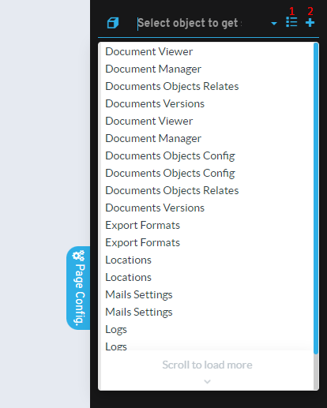

# Did you know you can access any object's configuration from the sidebar?

The **Page Config** sidebar works by default to configure the object you are currently viewing, but you can change its value to quickly access any other object.

## Main features

* **Quick access to configuration**: change the value in the sidebar to switch between different objects
* **List icon**: gives direct access to the object's listing
* **Plus (+) icon**: gives direct access to inserting new records

This feature provides an efficient way for developers to navigate and quickly access different sections of the application without having to go through multiple menu levels.

