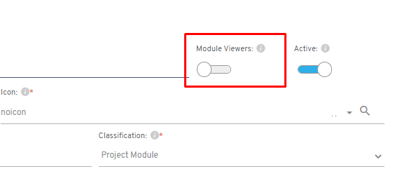
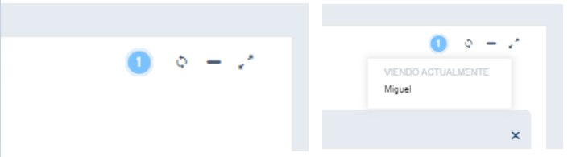

# Did you know there's an option to see which users are viewing the same module at the same time?

Starting with Flexygo version 4.9.0.x, a new feature in the module configuration lets you enable visibility of simultaneous users on list, edit, view and kanban type modules.

## How it works

When this option is enabled in the module's configuration, an indicator icon appears showing the number of people currently viewing the module. Hovering the cursor over this icon shows a list with the names of every connected user.

## Applicability

This feature is available on modules of the following types:

* List
* Edit
* View
* Kanban
