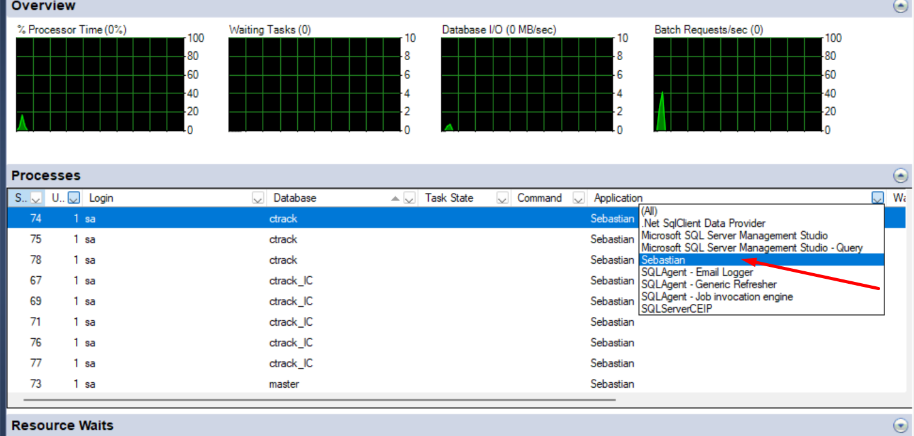
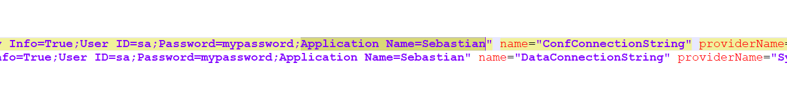

# ¿Sabías que puedes identificar el origen de una conexión SQL por aplicación?

Para analizar el origen de las conexiones a tu base de datos, es posible filtrar utilizando el nombre de la aplicación.

Flexygo incorpora esta funcionalidad automáticamente en nuevas instalaciones. Si necesitas añadirlo en una aplicación ya existente, deberás modificar tu archivo `web.config` e incorporar el atributo **Application Name** a tu cadena de conexión.

