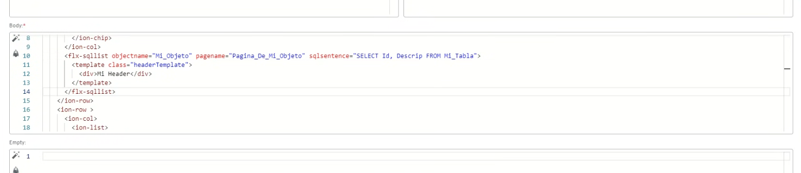

# Did you know the offline app's sqllist components can import templates?

Starting with version 6.4 of the offline application, you can use page templates directly in the `flx-sqllist` component.

## Implementation

To use this feature, two attributes must be added to the component:

* **PageName**: the page's name
* **ObjectName**: the name of the object whose configuration you want to use

The app will get that page's configuration (SQL statement, header, body and footer), but will only use the values that are not explicitly configured in the component.

## How it works

The system follows a priority hierarchy:

1. Explicit settings within the component take precedence
2. The referenced page's settings are applied as default values
3. This lets you combine custom elements with reusable templates

## Benefits

This feature enables more efficient development by reusing existing templates, letting the `flx-sqllist` component show listings on different pages without duplicating code.
