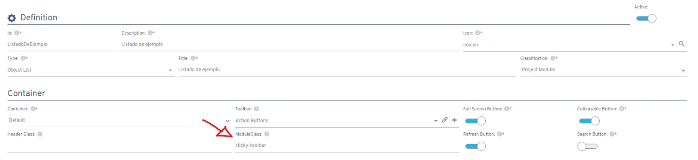
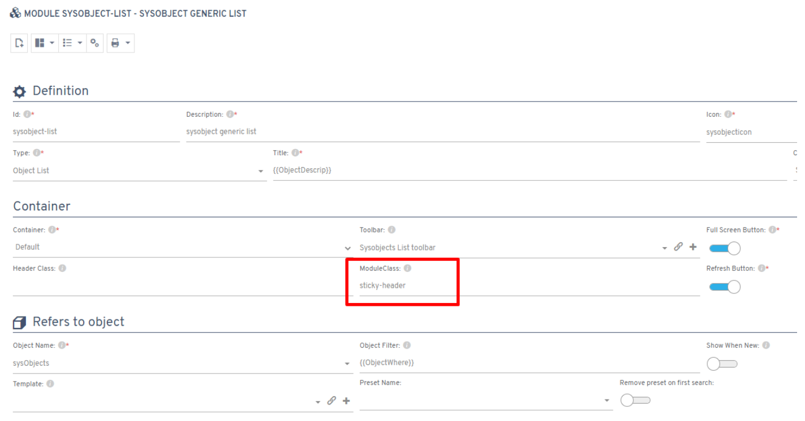

# Did you know you can pin the toolbar in place?

Since Flexygo version 4.9.0.2, you can keep the toolbar fixed at the top while scrolling through a module. To enable this feature, add the `sticky-toolbar` class to the corresponding module's configuration.

## Additional features

Similarly, you can also pin a listing's header using the `sticky-header` class. This keeps the header visible while scrolling through the data.

