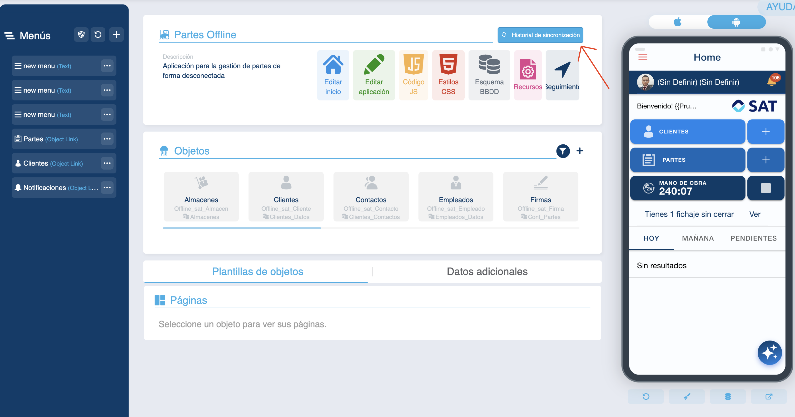
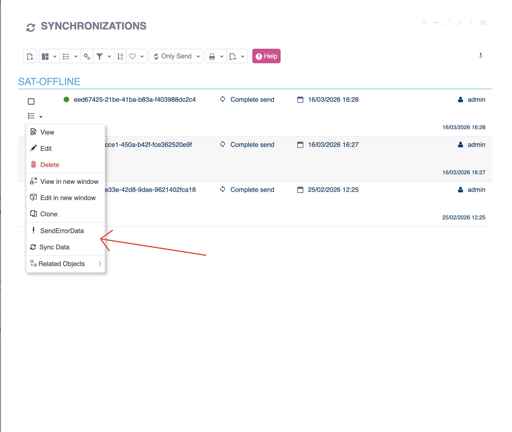

# Did you know you can review the Offline App's synchronizations from Flexygo?

From the offline application menu you can access the synchronization history. To do so, just press the button located at the top of the screen.

## Available features

Once you access the history, you will be able to:

* View the synchronizations performed
* Identify the types of synchronization that were run
* Restart or repeat the synchronization of specific data

