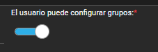
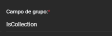
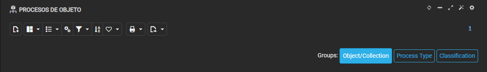

# ¿Sabías que puedes crear agrupaciones de plantillas que pueden ser seleccionadas y reordenadas por el usuario?

Al crear agrupaciones de plantilla en una lista, existe la posibilidad de marcar una opción denominada **"El usuario puede configurar grupos"** directamente en la configuración del template.



## Implementación técnica

Cuando esta opción está habilitada, se debe agregar una línea específica en la cabecera del template. El código propuesto utiliza un botón interactivo:

```html
<button class="btn {{groupButtonActive(this,'IsCollection')}}"
onclick="$(this).closest('flx-list')[0].toggleGroup('IsCollection');">
Object/Collection</button>
```

El parámetro `IsCollection` debe corresponder exactamente con el campo de grupo que se desea permitir activar o desactivar al usuario.



## Resultado esperado

Tras añadir una línea de código por cada agrupación que se quiera habilitar, los usuarios tendrán la capacidad de elegir qué agrupaciones desean que permanezcan activas en cada momento, proporcionando mayor flexibilidad y personalización de la interfaz.


