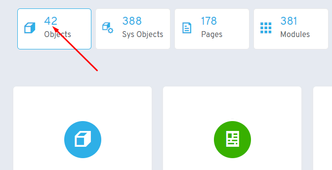
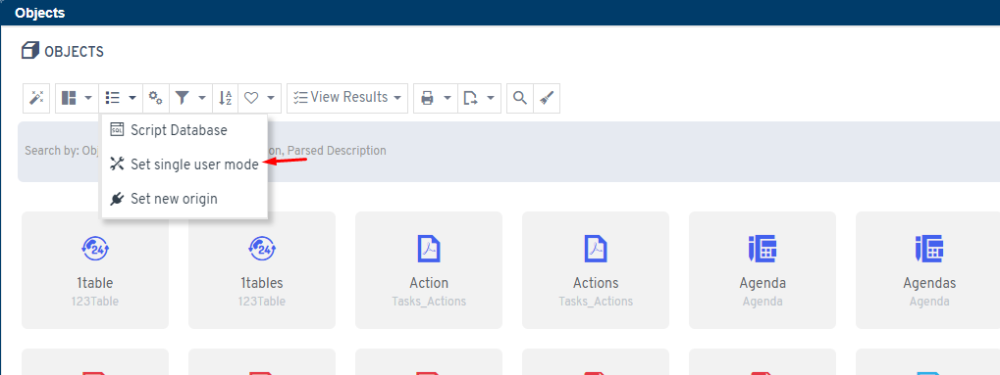
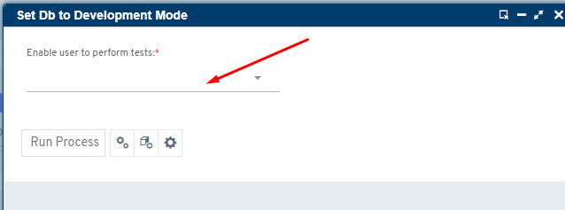

# ¿Sabías que puedes crear un entorno de pruebas sin preocuparte de la licencia gracias al proceso "Set Single User Mode"?

El proceso **Set Single User Mode** permite configurar un entorno de pruebas sin limitaciones de licencia.

## Propósito principal

Este proceso es especialmente útil cuando se traslada la base de datos de producción a un ambiente de pruebas, donde normalmente la licencia no funcionaría debido a diferencias de entorno y usuarios existentes.

## Funcionamiento automático

El proceso realiza automáticamente las siguientes acciones:

* Genera una nueva licencia de evaluación
* Bloquea todos los usuarios excepto guest, admin y un usuario seleccionado
* Permite desarrollo con admin y pruebas con el usuario elegido según su perfil/rol

## Ventajas

Este enfoque nos va a ahorrar todos los pasos explicados anteriormente y ya solo nos quedaría activar la nueva licencia.

!!! warning "Advertencia importante"
    Se recomienda verificar que se trabaja efectivamente en un entorno de pruebas diferenciado del de producción en cuanto a servidor, base de datos, configuración y nombre del proyecto.

## Acceso al proceso

Solo administradores pueden acceder desde **Admin Area → Colección de Objetos**.

En el proceso se selecciona un usuario que, junto con admin y guest, permanecerá activo.
