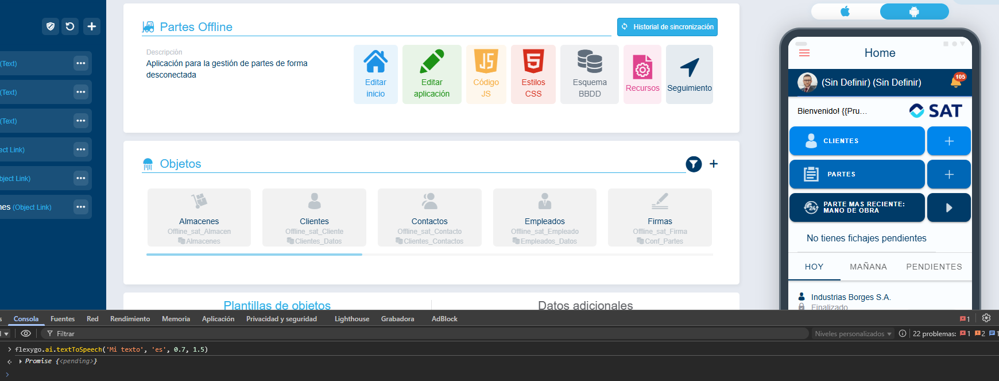

# ¿Sabías que la app offline puede leer mensajes en voz alta?

La plataforma Flexygo incorpora una capacidad de síntesis de voz mediante la función `flexygo.ai.textToSpeech`. Esta herramienta permite reproducir contenido de texto de forma audible.

## Características principales

* **Entrada de texto personalizable**: especifica cualquier contenido textual que desees que se reproduzca oralmente
* **Configuración de idioma**: aunque adopta por defecto la lengua del usuario, es posible modificarlo manualmente
* **Control de velocidad**: ajusta la velocidad de reproducción según tus preferencias
* **Control de volumen**: regula el nivel sonoro de la reproducción

