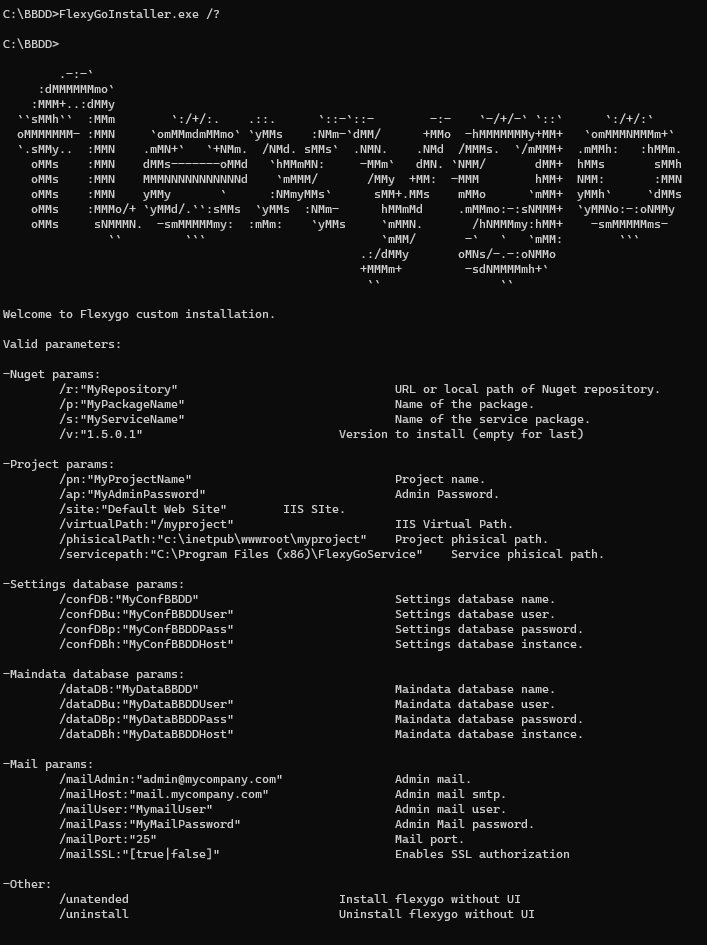

# ¿Sabías que puedes instalar Flexygo de forma desatendida por línea de comandos?

Flexygo permite realizar instalaciones sin interfaz gráfica utilizando parámetros de línea de comandos. Para visualizar todas las opciones disponibles, ejecuta:

```
./FlexygoInstaller.exe /?
```

## Ejemplo de instalación de CRM

A continuación se muestra un comando ilustrativo para instalar un sistema CRM:

```
./FlexygoInstaller.exe /unatended /r:"https://nuget.flexygo.com/nuget"
/p:"FlexygoCRM" /pn:"NombreCliente_CRM" /ap:"MyAdminPassword"
/virtualPath:"/CRM" /phisicalPath:"c:\Webs\CRM" /confDB:"CRM_IC"
/confDBu:"sa" /confDBp:"-a123456" /confDBh:"localhost"
/dataDB:"concello" /dataDBu:"sa" /dataDBp:"-a123456"
/dataDBh:"localhost" /mailAdmin:"admin@mycompany.com"
/mailHost:"mail.mycompany.com" /mailUser:"MymailUser"
/mailPass:"MyMailPassword" /mailPort:"25" /mailSSL:"true"
```



Este enfoque posibilita la automatización completa del proceso de instalación sin necesidad de intervención manual en la interfaz gráfica.
